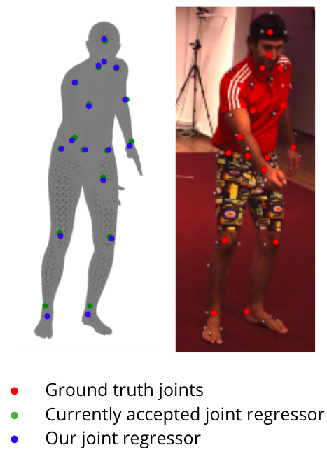

# A Simple Method to Boost Human Pose Estimation Accuracy by Correcting the Joint Regressor for the Human3.6m Dataset



## Using the joint regressor from the paper
The weights for the joint regressor from the paper are provided in ```models/retrained_J_Regressor.pt```.  

## Training a new joint regressor
The code for training a new joint regressor is provided in ```scripts/optimize.py```. Pseudo ground truth poses are initialized by [SPIN](https://github.com/nkolot/SPIN) estimates. The poses are iteratively optimized to be closer to the ground truth 3D joints while remaining realistic as according to the pose discriminator. These optimized poses are then used to supervise the new joint regressor. In theory this should be able to be applied to any dataset with corresponding ground truth 3D joints. 

## Citing
If you find this code useful for your research or the use data generated by our method, please consider citing the following paper:

	@Inproceedings{hedlin2022refinejreg,
	  Title          = {A Simple Method to Boost Human Pose Estimation Accuracy by Correcting the Joint Regressor for the Human3.6m Dataset},
	  Author         = {Hedlin, Eric and Rhodin, Helge and Yi, Kwang Moo},
	  Booktitle      = {CRV},
	  Year           = {2022}
	}
